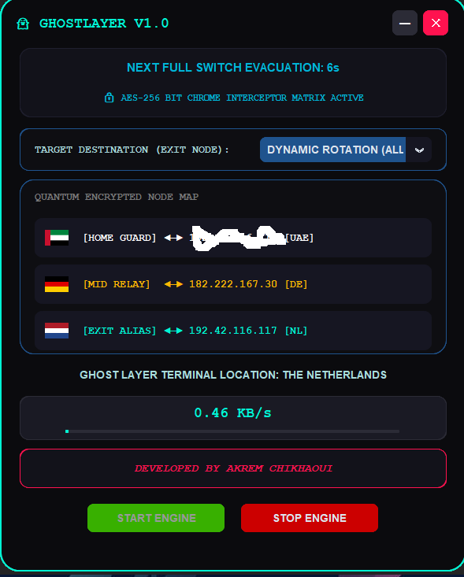

# 👻 GHOSTLAYER v1.0 — Global Tor Network Proxy Enforcer


> **GHOSTLAYER** is a cyberpunk-themed tactical proxy enforcer that routes 100% of Windows network traffic through the decentralized Tor network — with automated IP rotation, real-time throughput telemetry, and strict geographic exit-node locking.

---

## 📺 Demo & Interface Preview

### Live Dashboard
*Visualizes a fully encrypted 3-node tunnel map with live geographic flag rendering:*
`Home Guard ➜ Mid Relay ➜ Exit Alias`



> 📹 Video demo coming soon — see [`assets/demo_video.mp4`](assets/demo_video.mp4)

---

## ⚡ Core Features

| Feature | Description |
|---|---|
| 🔥 **Auto Tor Ignition** | Silently auto-detects and launches the Tor daemon — no manual setup required |
| 🌍 **Geo-Lock Exit Nodes** | Lock exits to `US`, `DE`, `GB`, `FR`, `CA`, or `NL` via `StrictNodes` enforcement |
| 🚩 **Triple-Node Flag Map** | Real-time flag rendering for Home IP, Middle Relay, and Exit Identity |
| 🛡️ **Registry Interceptor** | Injects `socks=127.0.0.1:9050` into Windows Internet Settings via `winreg` |
| 🔄 **Automated IP Rotation** | Scheduled circuit renewal with live velocity telemetry |
| 🧯 **Anti-Leak Failsafe** | `atexit` + `SIGINT`/`SIGTERM` handlers auto-restore clean proxy state on exit |

---

## 🛠️ System Requirements

### Operating System
- **Windows 10 / 11** (64-bit)
- Must be run as **Administrator** — modifies Windows Registry network keys

### Tor Installation *(Critical)*

GHOSTLAYER requires a local Tor daemon. Download from the [Official Tor Project](https://www.torproject.org/download/tor/).

The script auto-detects `tor.exe` from these paths:

```
C:\Tor\tor.exe
C:\Program Files\Tor\tor.exe
%USERPROFILE%\Desktop\Tor Browser\Browser\TorBrowser\Tor\tor.exe
```

### Python
- Python **3.9+**
- Dependencies listed in `requirements.txt`

---

## 🚀 Installation & Usage

**1. Clone the repository**
```bash
git clone https://github.com/your-username/GhostLayer.git
cd GhostLayer
```

**2. Install dependencies**
```bash
pip install -r requirements.txt
```

**3. Run as Administrator**

Right-click your terminal → *Run as Administrator*, then:
```bash
python main.py
```

---

## 🛑 Security & Disclaimer

**Anti-Leak Shield:** On exit (UI close button `✕` or `Ctrl+C`), GHOSTLAYER instantly rolls back the Windows system proxy to clean defaults — preventing an internet freeze or IP leak.

**Disclaimer:** This tool is designed strictly for open-source research, automation development, and privacy engineering. The author assumes no responsibility for misuse. Always comply with your local laws and regulations.

---

## 📁 Project Structure

```
GhostLayer/
├── main.py              # Entry point
├── requirements.txt     # Python dependencies
├── assets/
│   ├── screenshot.png   # UI preview
│   └── demo_video.mp4   # Demo recording
└── README.md
```

---

## 📜 License

This project is licensed under the **MIT License** — see [`LICENSE`](LICENSE) for details.

---

<div align="center">

*Built for privacy engineers, red teamers, and the anonymity-conscious.*

**[⭐ Star this repo](https://github.com/your-username/GhostLayer)** if you find it useful.

</div>
